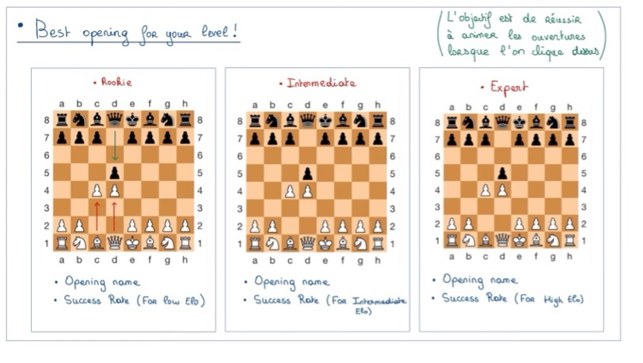

# Project : Milestone 2

**Due to 18th April, 5pm**

### I. Introduction 

Chess is an absolutely fascinating game. For many of us, it’s a childhood memory, learned with family and shared with loved ones. But chess is also much more than that: behind its apparent simplicity lies a world of strategy, precision, and mental endurance. Some even consider it a sport, as it demands intense focus and control.

It is precisely this duality that our website is built upon. Our goal is to speak to all types of users: from beginners just discovering the game to experienced players eager to explore its full complexity. That’s why our team, “Team GB,” designed this platform as a meeting point for all chess enthusiasts, whatever their level.

Right from the homepage, visitors will find fun anecdotes and accessible content to dive into the world of chess. As they browse, they will discover more technical analyses, drawn from the Lichess dataset. The site will feature several complementary sections: a general Dashboard to explore the main trends of the game, a Player Stats page to view a player’s performance using their ID, a Game Analysis section to study factors that influence results, and an Opening Explorer dedicated to openings. A final About page will present the project and the team. From discovering the pieces to diving into advanced strategies, we hope everyone will find something to learn or explore.

### II. Core Visualization 

Our website aims to offer an interactive statistical analysis of a chess game dataset from Lichess. The goal is to make the game’s dynamics accessible to a broad audience, using simple yet impactful visualizations. These might include:
- A visualization of the most common openings, by popularity and player level  
- A representation of win rates by skill level  
- A comparative diagram showing White vs. Black win rates depending on the openings played  
- The ability to enter a Lichess ID to access a personalized player profile, with stats such as win rate, rating progression, and even an animated recent game on a chessboard  
- A heatmap of the board showing active or critical zones  
- A visualization of the typical movement of each piece  

### III. Additional Features 

We have also considered several additional features that are not essential to the core project but would bring added value. These include:
- An analysis of game formats: frequency, average duration, and impact on results  
- A qualitative evaluation of moves depending on the player’s level, with a categorization of errors (tactical, strategic, or time-related)  
- Demonstrations of well-known strategies, directly visualized on an interactive chessboard  

### IV. Sketches of Potential Graphs 

To give an initial idea of what our visualizations might look like, we have sketched a few representative graphs.

**→ Graph ideas for opening strategies:**  

    
    
    

**→ Graph ideas for statistical analysis of the game:**  

    
    
    

**→ Graph idea for piece presentation and introductory strategies:**  

    
    

### V. Visualization Tools and Related Lecture 

To create our visualizations, we will use Python with pandas, matplotlib, and seaborn for basic stats and charts, as covered in the « Tabular Data and Graphs » lectures. For more interactive elements like heatmaps and animated boards, we’ll use D3.js, based on the « D3.js », « Interactive D3.js », and « Marks, Channels » lectures. The interactive chessboard will be built with JavaScript and the Lichess API, following what we saw in the « Javascript » course. For building the interface or dashboard, we might use Streamlit or React, as seen in « Beyond Visualization ».