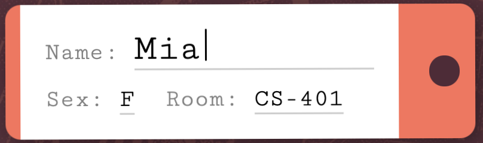
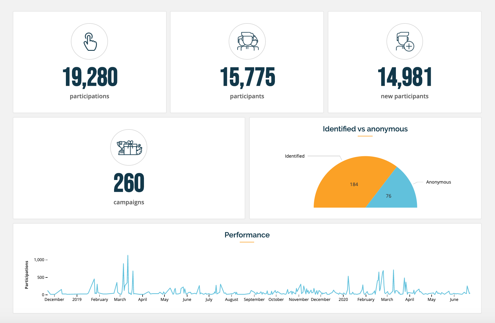
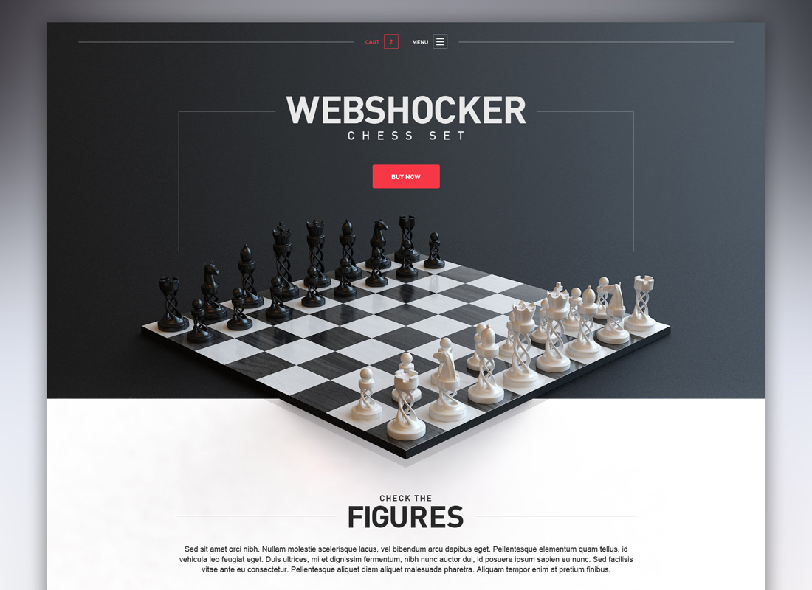
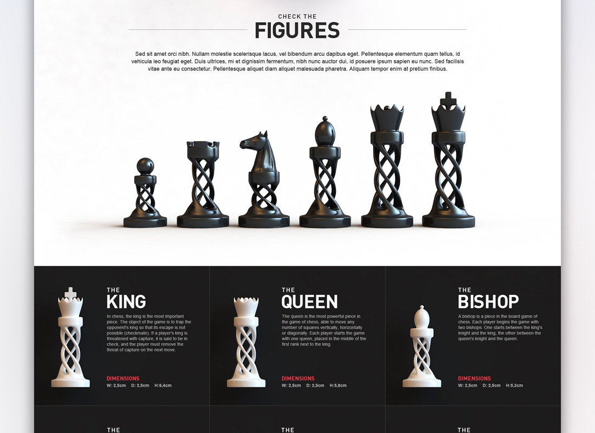
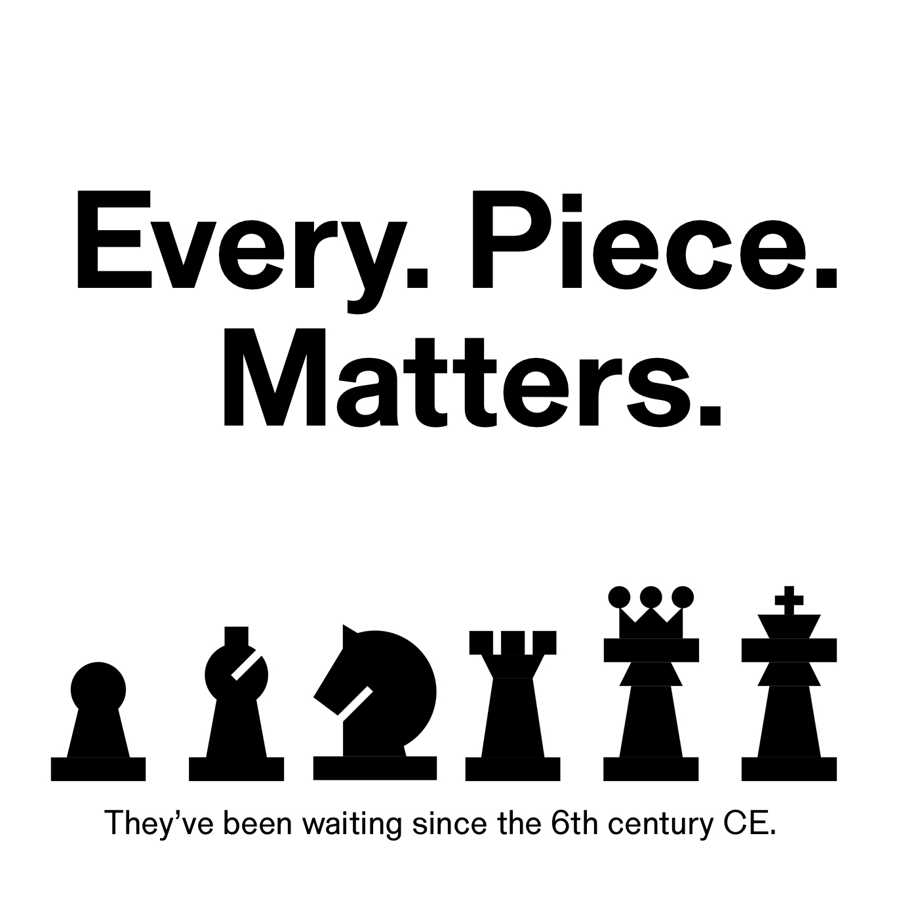
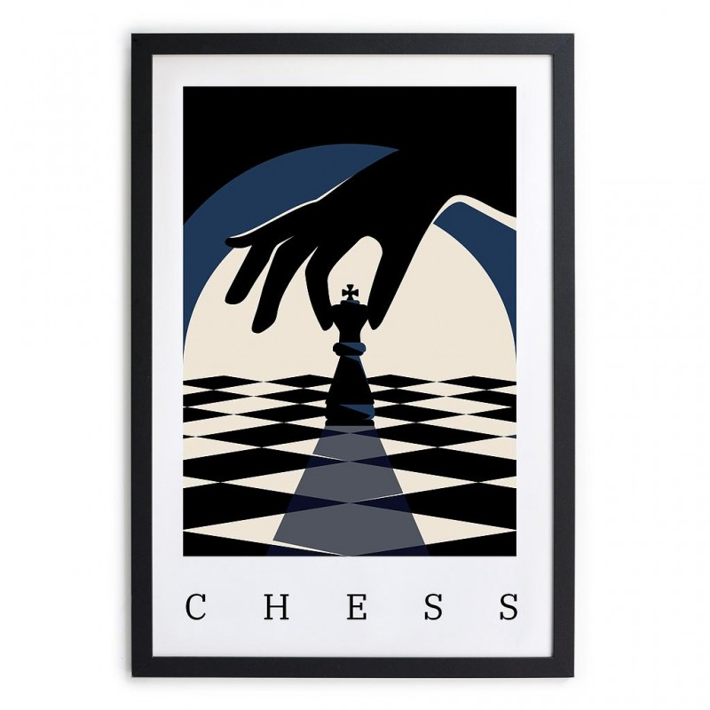
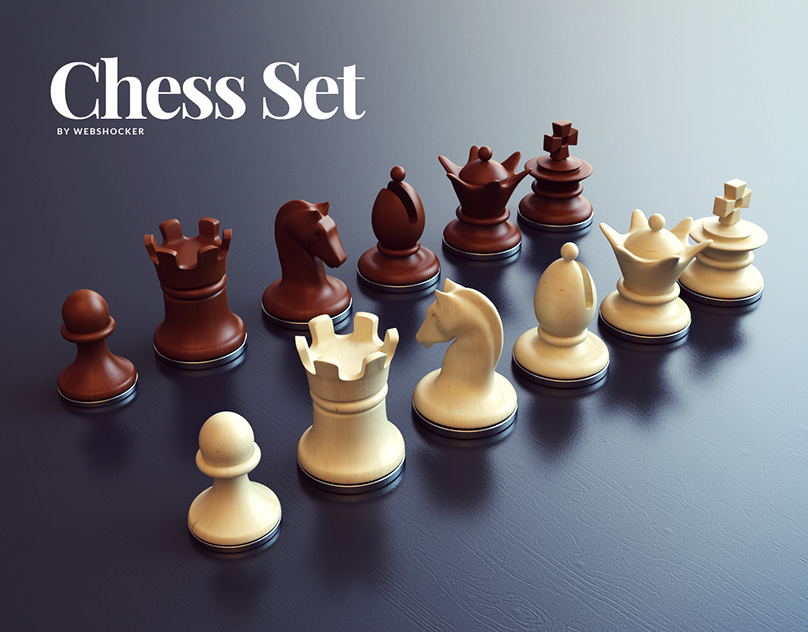

# Project of Data Visualization (COM-480)

| Student's name | SCIPER |
| -------------- | ------ |
| Fanny Missilier | 346565 |
| Zacharie Bourlard | 329920 |
| Rodrigue de Guerre | 327683 |

[Milestone 1](#milestone-1) • [Milestone 2](#milestone-2) • [Milestone 3](#milestone-3)

## Milestone 1 (21st March, 5pm)

**10% of the final grade**

This is a preliminary milestone to let you set up goals for your final project and assess the feasibility of your ideas.
Please, fill the following sections about your project.

*(max. 2000 characters per section)*

### Dataset

> Find a dataset (or multiple) that you will explore. Assess the quality of the data it contains and how much preprocessing / data-cleaning it will require before tackling visualization. We recommend using a standard dataset as this course is not about scraping nor data processing.
>
> Hint: some good pointers for finding quality publicly available datasets ([Google dataset search](https://datasetsearch.research.google.com/), [Kaggle](https://www.kaggle.com/datasets), [OpenSwissData](https://opendata.swiss/en/), [SNAP](https://snap.stanford.edu/data/) and [FiveThirtyEight](https://data.fivethirtyeight.com/)), you could use also the DataSets proposed by the ENAC (see the Announcements section on Zulip).

The dataset we are using is from  [Kaggle](https://www.kaggle.com/datasets) website, focusing on chess statistics to analyze user game data. It is a set of just over 20,000 games collected from a selection of users on the site Lichess.org

Link to the dataset:
- [Chess Game Dataset (Lichess)](https://www.kaggle.com/datasets/datasnaek/chess)

### Problematic

> Frame the general topic of your visualization and the main axis that you want to develop.
> - What am I trying to show with my visualization?
> - Think of an overview for the project, your motivation, and the target audience.

- **Our Motivation:**  
  Our project presents chess through a visual and interactive lens, making game analysis and trend exploration accessible to all—curious minds, beginners, and experienced players alike.  

  At first glance, chess appears to be a simple 64-square board with 32 pieces. However, beneath this simplicity lies immense strategic depth. Driven by our passion for the game, we aim to highlight key patterns and strategies through data-driven visualizations and simulations.  

- **What we are trying to show:**  
  How chess data can be structured and visualized to provide insightful analysis for both casual enthusiasts and advanced players.  

- **The kind of visualizations we plan to have:**  
  - Personalized player stats (win rates, favorite openings)  
  - Interactive game replays and move animations  
  - Network graphs of recurring opponents  
  - Heatmaps of popular openings based on player skill levels  
  - Trend analysis on winning strategies and time control impact  

- **Our Target Audience:**  
  - Chess enthusiasts of all levels  
  - Beginners looking for an interactive learning experience  
  - Experienced players seeking data-driven insights  
  - Anyone interested in the intersection of chess and data visualization 

### Exploratory Data Analysis

> Pre-processing of the data set you chose
> - Show some basic statistics and get insights about the data

We did a first analysis of our dataset in `Milestone1.ipynb` in order to get some insights about the data.

### Related work

> - What others have already done with the data?
> - Why is your approach original?
> - What source of inspiration do you take? Visualizations that you found on other websites or magazines (might be unrelated to your data).
> - In case you are using a dataset that you have already explored in another context (ML or ADA course, semester project...), you are required to share the report of that work to outline the differences with the submission for this class.

#### What others have already done with the data?

The Lichess dataset has been widely used to train AI models, developing algorithms that predict optimal moves and evaluate positions. It is also used to analyze players’ styles across different levels (beginner, intermediate, expert), recommending suitable openings and training methods. Other applications include reconstructing games, creating visualizations to identify recurring patterns, and studying the impact of certain moves on the game's outcome. Additionally, the dataset helps detect suspicious movements that could indicate cheating.

#### Sources of inspiration

One clear source of inspiration is Lichess, which offers an interactive chessboard for online games. Our project aims to take this further by using the Lichess dataset for an engaging and educational chess analysis, enabling users to better understand the game and access data on game trends. The goal is to provide a modern, visually appealing interface that draws attention through innovative design elements, such as reimagined chessboard grids, unique color palettes, and redefined piece shapes. For example, we could use animated transitions to show the progression of a game, allowing users to explore sequences of moves interactively.

    

    

    
    

<!-- 

    
    

 -->

    

#### Why is our approach original?

Unlike most chess sites that focus purely on gameplay, our project integrates an interactive, visual learning experience. By leveraging the Lichess dataset, we offer an educational and engaging approach to understanding chess trends. We aim to move beyond the win/loss narrative and spark curiosity, helping users progress by offering visual analytics, interactive animations, and relevant stats.

The project draws on the need for a fresh, appealing visual identity in the chess world, making chess accessible and enjoyable for users of all levels through data-driven insights and interactive features.

## Milestone 2 (18th April, 5pm)

**10% of the final grade**

## Milestone 3 (30th May, 5pm)

**80% of the final grade**

## Late policy

- < 24h: 80% of the grade for the milestone
- < 48h: 70% of the grade for the milestone

